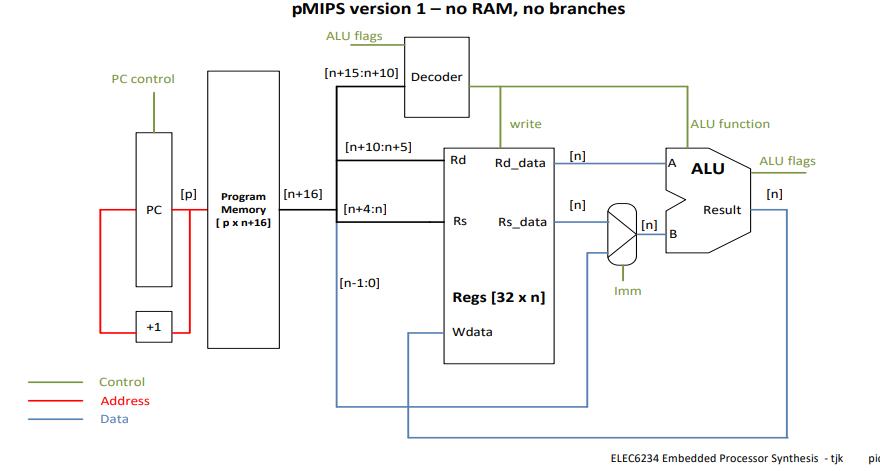
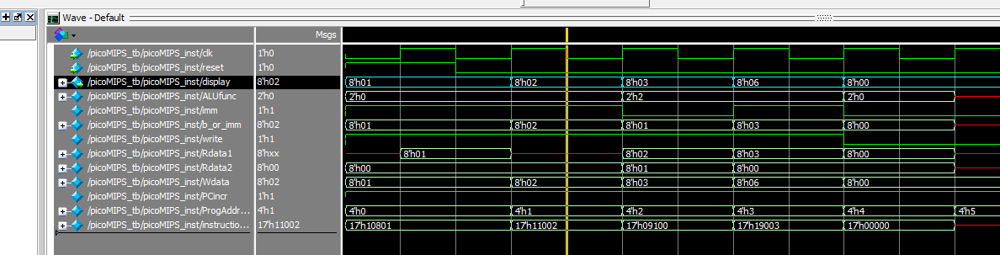

利用SystemVerilog语言编写FPGA 实现picoMIPS并且能够进行仿射变换的计算
* 使用的软件及版本
  * quartus II 13.1
  * modelsim SE 10.4
  * vscode

* 使用的语言
  * systemVerilog

### picoMIPS架构



#### 组件
* PC(Program Counter) : 程序计数器
  * PC的主要功能是取memory中的数据。 
  * 输入: 时钟clk, 复位reset, 是否对输出加1(向下一个指令移动)PCincr
  * 输出: PCout
  * 实现文件: pc.sv

* Prog( Program memory): 程序内存，存放指令
  * 输入： address
  * 输出： 指令
  * 实现文件: prog.sv

* Decoder: 解码器 : 用于解析指令给ALU使用
  * 所需5个指令 所以需要3bits的操作数
    * load : 加载数据到寄存器
    * add : 加寄存器中的两个数字
    * addI : 加立即数
    * MULI : 乘立即数
    * NOP : 什么也不干
  * 输入: operation_code
  * 输出: ALUFunc(add,mul),imm(ALU是否读取立即数),write(是否写入寄存器)
  * 实现文件: decoder.sv

* Regs: 寄存器 : 主要功能是存储中间数据
    * 输入: 
      * 两个输入地址
      * 一个write写入标识
      * 一个wdata写入数据
    * 输出: 两个输出数据
    * 实现文件: regs.sv


* ALU: 逻辑计算单元
  * ALU函数一共有三个
    * ADD: 加法 10
    * MUL: 乘法 11
    * Always B : 永远输出B 00
  * 输入: 有符号的a,b输入，ALUFunc
  * 输出: result
  * 实现文件: alu.sv

### 验证波形图
```
// 指令LOAD测试
10000100000000001 // LOAD %1 %0 1 加载数字1到1号寄存器
10001000000000010 // LOAD %2 &0 2 加载数字2到2号寄存器
// 测试加法
01001000100000000 // ADD %2 %1   %2 = %2+%1  加法 将2号和1号加起来给2号
// 测试加立即数
11001000000000011 //ADDI %2 %0 3  此时%2应该是6
00000000000000000 // NOP 清空
```
